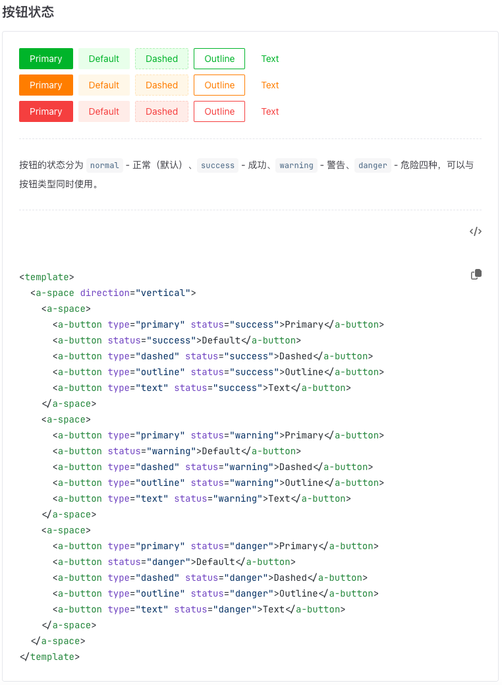

# vitepress-markdown-demo-block

> 一个基于 `vitepress` 的 `markdown` 工具，主要用于组件库文档中的组件和源码展示

### 开始使用

> npm install @yuci/vitepress-markdown-demo-block -D

任意新建一个 `md` 文件，`components.md`

```md
:::demo 按钮基本用法

<ButtonBasic />

:::

:::demo 我们提供多种预设色彩的标签样式，通过 `color` 设置不同颜色。如果预设值不能满足你的需求，`color` 字段也可以设置自定义色值。

<tab-color />

:::
```

`:::`后必须写上 `demo`，`demo` 后是组件的使用说明

:warning: `:::`中包裹组件的命名要求：`目录名+文件名`，`Button`为目录名，`Basic`即`basic.vue`文件

须遵循 `vue` 组件写法规范，以下写法都可：

- `<MyComponent></MyComponent>`
- `<my-component></my-component>`
- `<MyComponent />`
- `<my-component />`

### 基础目录结构

```
.
├─ .vitepress
│  ├─ config.ts
│  ├─ theme
│  │    ├─ index.ts
├─ demos
│  ├─ avatar
│  │     ├─ basic.vue
│  │     ├─ others.vue
│  ├─ button
│  │─ table
│  └─ index.ts
...

```

### 组件注册

在 `vitepress` 工程下找到 `.vitepress/config.ts` 文件，加入一下代码：

```ts
import { defineConfig } from 'vitepress'
import demoBlockPlugin from '@yuci/vitepress-markdown-demo-block'

export default defineConfig({
  markdown: {
    config: (md) => md.use(demoBlockPlugin)
    // config: (md) => md.use(demoBlockPlugin, 'myDemosDir')
  }
})
```

`md.use()` 可传两个参数，第一个参数为当前插件即 `demoBlockPlugin` , 第二个参数选传，
默认值为 `demos` ，即存放组件 demo 的文件夹，

:warning: 如果你存放组件的目录不叫 `demos` ,则须
将传入第二个字段，否则无法正确加载组件。

`.vitepress/theme/index.ts` 文件中去全局注册

```ts
import DefaultTheme from 'vitepress/theme'
import DemoBlockContainer from '@yuci/vitepress-markdown-demo-block/block'
import Demos from 'demos' // 你的demos路径

export default {
  ...DefaultTheme,
  enhanceApp({ app }) {
    app.use(Demos) // 全局注册demos中的组件
    app.component('DemoBlockContainer', DemoBlockContainer) // 全局注册DemoBlockContainer
  }
}
```

对 `demos` 下的文件做全局注册，仅供参考

```ts
import { startCase } from 'lodash-es'

const modules = import.meta.glob('./**/*.vue')

export default {
  install: (app) => {
    // eslint-disable-next-line guard-for-in
    for (const path in modules) {
      const index = path.indexOf('.vue')
      const newPath = path.substring(0, index)
      const name = startCase(newPath).split(' ').join('')
      modules[path]().then((mod) => {
        app.component(name, mod.default) // demos下的组件全局注册
      })
    }
  }
}
```

### 案例


